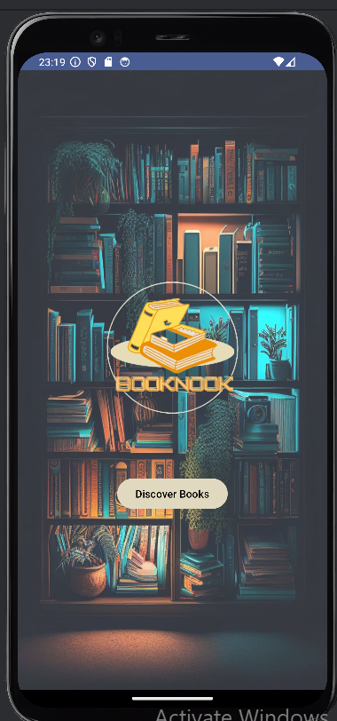
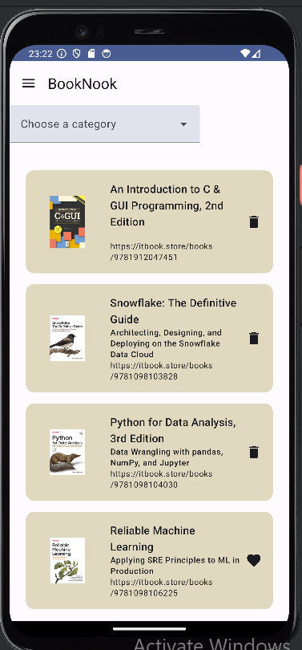
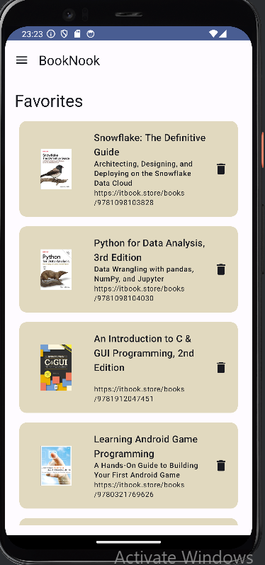
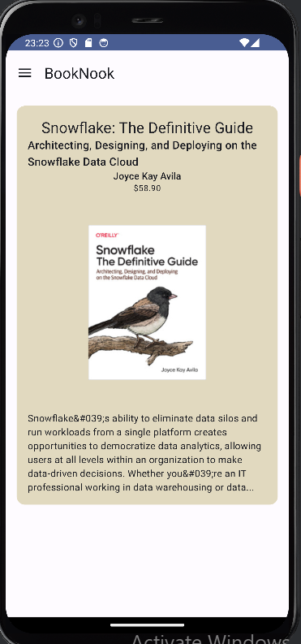

<<<<<<< HEAD
# BookNook
=======
# Dokumentacija za Android aplikaciju BookStore

## Uvod

Aplikacija BookStore za Android je korisnički prijateljska aplikacija namijenjena otkrivanju, odabiru i upravljanju omiljenim knjigama. Koristeći moderne prakse razvoja za Android, aplikacija je izgrađena koristeći Jetpack Compose za korisnički interfejs i slijedi MVVM (Model-View-ViewModel) arhitekturu. Ovaj dokument pruža detaljan pregled strukture aplikacije, funkcionalnosti i komponenti, zajedno s općim konceptima koji su relevantni za Android platformu.

## Screenshots Aplikacije

### Ekran za Početni Prikaz

### Ekran za Otkrivanje Knjiga

### Ekran za Omiljene Knjige

### Ekran za Detalje Knjige

## Arhitektura Aplikacije

### MVVM Arhitektura

Aplikacija BookStore slijedi MVVM arhitekturu, koji razdvaja korisnički interfejs (UI) od poslovne logike i manipulacije podacima. Tri osnovne komponente u ovom obrascu su:

- **Model**: Predstavlja podatke i poslovnu logiku aplikacije. Ovaj sloj je odgovoran za dohvaćanje podataka sa mreže ili baze podataka.
- **View**: Predstavlja korisnički interfejs aplikacije. Ona posmatra ViewModel za promjene podataka i ažurira korisnički interfejs prema tome.
## ViewModel

ViewModel klasa je čuva stanja ekrana. Izlaže stanje korisničkom interfejsu i enkapsulira pripadajuću logiku. Njena glavna prednost je što kešira stanje i čuva ga kroz promjene konfiguracije. To znači da vaš korisnički interfejs ne mora ponovo dobavljati podatke prilikom navigacije između aktivnosti ili nakon promjene konfiguracije, poput rotiranja ekrana.

### Navigacijski Komponenta

Aplikacija koristi Jetpack Navigation Component za upravljanje navigacijom između različitih ekrana. Navigation Component pojednostavljuje implementaciju navigacije i pruža konzistentan način za upravljanje navigacijom kroz aplikaciju.

## Opisi Klasa

### MainActivity

`MainActivity` je ulazna tačka aplikacije. Proširuje `ComponentActivity` i postavlja glavni sadržaj pomoću Jetpack Compose-a.

#### Odgovornosti

- Inicijalizacija baze podataka.
- Postavljanje sadržaja na `BookStoreNavHost` umotan u `BookStoreTheme`.

### Screen

Sealed klasa `Screen` definiše različite ekrane (rute) u aplikaciji. Svaki ekran ima jedinstvenu rutu za navigaciju.

#### Odgovornosti

- Definisanje ruta za različite ekrane.
- Pružanje pomoćnih metoda za kreiranje ruta sa parametrima.

### BookStoreNavHost

`BookStoreNavHost` je composable funkcija koja postavlja navigacioni host za aplikaciju, upravljajući navigacijom između različitih ekrana.

#### Odgovornosti

- Upravljanje navigacijskom ladicom.
- Definisanje navigacionog grafa sa composable destinacijama.

### BookStoreApp

`BookStoreApp` je composable funkcija koja prikazuje listu knjiga na osnovu trenutne orijentacije uređaja.

#### Odgovornosti

- Posmatranje podataka o knjigama iz ViewModel-a.
- Prikazivanje knjiga u vertikalnoj listi ili mreži, zavisno od orijentacije uređaja.

### BookCard

`BookCard` je composable funkcija koja prikazuje detalje jedne knjige i omogućava korisnicima označavanje knjige kao omiljene.

#### Odgovornosti

- Prikazuje detalje knjige kao što su naslov, podnaslov i slika.
- Upravlja korisničkim interakcijama za označavanje knjige kao omiljene.
### LandingScreen Composable Funkcija

#### Pregled

`LandingScreen` je composable funkcija u Android aplikaciji BookStore koja predstavlja početni ekran korisničkog interfejsa. Ova funkcija kombinuje sliku naslovne strane knjige sa logotipom aplikacije i dugmetom za otkrivanje knjiga.

#### Parametri

- **navController**: NavController korišten za navigaciju unutar aplikacije.

#### Detalji Implementacije

Funkcija `LandingScreen` koristi `Box` za postavljanje elemenata na ekranu:
- **Slika Naslovne Strane**: Prikazuje se kao pozadinska slika sa smanjenom providnošću kako bi istakla ostale elemente.
- **Logotip Aplikacije**: Prikazuje se u sredini ekrana sa veličinom od 300dp.
- **Dugme "Discover Books"**: Omogućava korisnicima da pređu na ekran za otkrivanje knjiga kada se klikne.

#### Primjer Korištenja

Composlabe funkcija `LandingScreen` pruža korisnicima intuitivan početak istraživanja knjiga u aplikaciji BookStore, kombinujući privlačan dizajn s funkcionalnošću navigacije unutar aplikacije.

### Metoda `fetchNewBooks()`

Asinkrono dohvaća informacije o novim knjigama koristeći RetrofitClient.
Ažurira `_booksData` sa dohvaćenim knjigama.

### Metoda `fetchFavoriteBooks()`

Asinkrono dohvaća informacije o omiljenim knjigama korisnika koristeći RetrofitClient i pristupajući SQLite bazi podataka putem `favoriteDao`.
Ažurira `_favoriteBooks` sa dohvaćenim informacijama.

### Metoda `toggleFavorite(isbn13: String, isFavorite: Boolean)`

Omogućava dodavanje ili uklanjanje knjige iz liste omiljenih.
Ažurira bazu podataka i `_favoriteBooks` na osnovu korisničkog izbora.

### Metoda `isFavorite(isbn13: String)`

Provjerava da li je određena knjiga označena kao omiljena.
Koristi `favoriteDao` za provjeru u SQLite bazi podataka.

## Metoda `refreshData()`

Osvježava podatke o omiljenim i novim knjigama.

### Metoda `searchBooks(query: String): LiveData<List<Book>>`

Pretražuje knjige na osnovu korisničkog upita koristeći RetrofitClient.
Vraća `LiveData` objekat sa rezultatima pretrage.

### Metoda `fetchBookInfo(isbn13: String): LiveData<BookInfo?>`

Dohvata detaljne informacije o određenoj knjizi na osnovu ISBN-13.
Vraća `LiveData` objekat sa informacijama o knjizi.

### Upotreba

`MyViewModel` služi kao centralno mjesto za upravljanje podacima vezanim za knjige u aplikaciji BookStore, pružajući sučelje za dohvaćanje novih knjiga, upravljanje omiljenim knjigama i pretragu knjiga korisnika. Ova klasa integriše `RetrofitClient` za komunikaciju sa backend-om aplikacije i SQLite bazu podataka putem `favoriteDao` za lokalno skladištenje podataka o omiljenim knjigama korisnika.

## DiscoverScreen
`DiscoverScreen` je composable funkcija u aplikaciji BookStore za Android koja omogućava korisnicima da otkriju knjige po odabranim kategorijama. Ovaj ekran sadrži padajući meni za odabir kategorije knjiga i prikazuje listu knjiga na osnovu odabrane kategorije.

### Parametri

- `navController`: NavController koji se koristi za navigaciju unutar aplikacije.
- `viewModel`: ViewModel klasa koja se koristi za upravljanje podacima.

### Implementacija

`DiscoverScreen` koristi Retrofit klijenta za dohvaćanje podataka o knjigama sa udaljenog API-ja. Ovaj klijent se obično inicijalizuje u `ViewModel` sloju aplikacije kako bi se odvojila logika dohvatanja podataka od korisničkog interfejsa.

### InfoScreen Composable Funkcija

#### Pregled

`InfoScreen` je composable funkcija u Android aplikaciji BookStore koja prikazuje detalje o određenoj knjizi na osnovu njenog ISBN-13 broja. Funkcija koristi LiveData za asinkrono dobavljanje informacija o knjizi i prikazuje ih u okviru Material3 Card komponente.

#### Parametri

- **navController**: NavController korišten za navigaciju unutar aplikacije.
- **isbn13**: ISBN-13 broj knjige za koju se dobavljaju informacije.
- **viewModel**: ViewModel klasa koja upravlja poslovnim logikama i stanjem aplikacije.

#### Detalji Implementacije

Funkcija `InfoScreen` prvo dobavlja podatke o knjizi pozivom `fetchBookInfo(isbn13)` iz `viewModel`-a. Kada se podaci uspješno dobave, prikazuju se u okviru `Card` komponente koja sadrži:
- Naslov, podnaslov i autore knjige.
- Cijenu knjige.
- Sliku knjige, ako je dostupna.
- Opis knjige.

#### Primjer Korištenja

Ova composable funkcija omogućava korisnicima da brzo i lako pregledaju detalje o knjizi na osnovu njenog ISBN-13 broja, pružajući intuitivan korisnički interfejs i informacije u skladu sa modernim dizajnom Material3 biblioteke.

### SelectScreen Composable Funkcija

#### Pregled

`SelectScreen` je composable funkcija u Android aplikaciji BookStore koja služi za prikazivanje liste knjiga na osnovu pretrage. Koristi Jetpack Compose za dinamičko prikazivanje knjiga u vertikalnoj listi ili mreži, zavisno od orijentacije uređaja.

#### Parametri

- **navController**: NavController korišten za navigaciju unutar aplikacije.
- **query**: String koji predstavlja upit za pretragu knjiga.
- **viewModel**: ViewModel (`MyViewModel`) koja upravlja podacima i poslovnom logikom.

#### Detalji Implementacije

Funkcija `SelectScreen` dobavlja listu knjiga na osnovu zadatog `query` korištenjem ViewModel (`MyViewModel`). Prati promjene u listi knjiga pomoću `observeAsState()` i dinamički prikazuje listu u skladu sa orijentacijom uređaja.

#### Obrada Orijentacije Uređaja

Ekran prilagođava izgled na osnovu orijentacije uređaja:
- **Vertikalna Orijentacija**: Prikazuje knjige u jednoj koloni koristeći `LazyColumn`.
- **Horizontalna Orijentacija**: Prikazuje knjige u dvije kolone koristeći `LazyVerticalGrid`.

#### Rubni Slučajevi

- **Nema Pronađenih Knjiga**: Ako nema knjiga koje odgovaraju pretrazi, prikazuje se poruka "Nema pronađenih knjiga" koristeći `Text`.

#### Primjer Korištenja

Composable funkcija `SelectScreen` unapređuje korisničko iskustvo dinamičkim prilagođavanjem izgleda na osnovu orijentacije uređaja, omogućavajući intuitivno istraživanje i odabir knjiga u aplikaciji BookStore.

## Opći Koncepti Android-a

# Korištenje API-ja i Room baze podataka u Android Studiju

## Korištenje API-ja

API (Application Programming Interfaces) omogućavaju Android aplikacijama komunikaciju sa udaljenim serverima radi dohvatanja podataka. U Android razvoju, korištenje API-ja uključuje sljedeće korake:

### Retrofit Biblioteka

Retrofit je popularna biblioteka za rad sa HTTP zahtjevima i odgovorima. Definiše se Retrofit interfejs koji opisuje API servise, putanje, parametre i odgovore.

### AsyncTask ili Coroutines

Za asinkrono izvođenje mrežnih zahtjeva, koriste se AsyncTask (stariji pristup) ili Coroutines (moderniji pristup) radi izbjegavanja blokiranja glavne niti.

### Serializacija i Deserializacija

Podaci dobijeni iz API-ja obično su u JSON formatu. Gson ili Moshi biblioteke se koriste za automatsko mapiranje JSON podataka na objekte (deserializacija) i obrnuto (serializacija).

## Korištenje Room baze podataka

Room je biblioteka za perzistenciju podataka koja pojednostavljuje rad sa SQLite bazom podataka u Android aplikacijama. Ključne komponente Room biblioteke uključuju:

### Entity

Predstavlja strukturu podataka koja se čuva u bazi podataka. Svaka entitet ima svoju tabelu.

### DAO (Data Access Object)

DAO definiše metode za pristupanje bazi podataka, uključujući upite za dodavanje, čitanje, ažuriranje ili brisanje podataka.

### Database

Apstrakcija baze podataka u aplikaciji. Room automatski generiše implementaciju baze podataka na osnovu definicije DAO-a i Entity-ja.

### Asinkrone Operacije

Room operacije se često izvršavaju asinkrono, koristeći Coroutines ili AsyncTask, kako bi se osigurala responsivnost korisničkog interfejsa.

## Integracija u Android Studio

U Android Studiju, integracija API-ja i Room baze podataka obično uključuje:

- Dodavanje zavisnosti u `build.gradle` datoteku.
- Definisanje Retrofit servisa za komunikaciju sa API-jem.
- Implementacija Room DAO-a za pristup lokalnoj bazi podataka.
- Upravljanje životnim ciklusom komponenti kao što su aktivnosti i fragmenti.

Korištenje API-ja i Room baze podataka omogućava Android programerima efikasno razvijanje aplikacija koje su povezane sa serverom radi dohvatanja podataka i koje istovremeno nude brz i pouzdan pristup lokalno skladištenim podacima.

### Room Baza Podataka

Room je biblioteka za perzistenciju koju pruža Jetpack, koja apstrahira sloj iznad SQLite-a kako bi omogućila jednostavan pristup bazi podataka. Ova biblioteka uključuje nekoliko ključnih komponenti koje olakšavaju rad s bazom podataka u Android aplikacijama:

#### Ključni Komponenti

- **Entity**: Predstavlja strukturu podataka ili tabelu unutar baze podataka.
- **DAO (Data Access Object)**: DAO definiše metode za pristup podacima u bazi. Ove metode omogućavaju operacije poput umetanja, ažuriranja, brisanja ili dohvatanja podataka iz baze.
- **Database**: Predstavlja apstraktnu klasu koja sadrži definicije DAO-ova i predstavlja glavnu tačku pristupa bazi podataka. Room generiše implementaciju ove klase na osnovu definisanih DAO-ova.

Room je posebno koristan jer automatski generiše SQL kod za kreiranje i upravljanje bazom podataka, čime se smanjuje potreba za ručnim pisanjem SQL upita i olakšava razvoj aplikacija.

### Activity

Activity predstavlja jedan ekran u Android aplikaciji s kojim korisnici mogu interagovati kako bi izvršili određene akcije. Svaka aplikacija obično sastoji se od više aktivnosti, pri čemu svaka ima svoj UI layout i ponašanje. Ključne tačke aktivnosti uključuju:

#### Ključne Tačke

- Djeluje kao ulazna tačka za korisničku interakciju.
- Može da hostuje fragmente i druge UI komponente.

Activity također upravlja životnim ciklusom, što znači da prolazi kroz različite faze kao što su kreiranje, pokretanje, pauziranje, zaustavljanje i uništavanje. Ove faze omogućavaju Android sistemu da efikasno upravlja resursima aplikacije i omogući korisnicima glatko iskustvo korištenja.

### Fragment

Fragment je ponovljiva komponenta korisničkog interfejsa koja predstavlja dio UI-a aplikacije sa svojim vlastitim layoutom i ponašanjem. Glavne karakteristike fragmenata uključuju:

#### Ključne Tačke

- Fragmenti se koriste za izgradnju dinamičkih i fleksibilnih UI-ova.
- Mogu se dodavati, uklanjati ili zamijeniti unutar jedne aktivnosti tokom izvršavanja aplikacije.

Fragmenti su posebno korisni za izgradnju modularnih UI-ova koji se mogu koristiti na različitim ekranima ili ponovo koristiti unutar iste aktivnosti.

### Životni Ciklus

Životni ciklus Android komponente, kao što su Activity ili Fragment, upravlja se od strane Android sistema kako bi se omogućilo efikasno upravljanje resursima i UI-em. Ključni događaji životnog ciklusa uključuju:

# Upravljanje životnim ciklusom aktivnosti

Tokom svog životnog vijeka, aktivnost prolazi kroz nekoliko stanja. Koristite niz callback metoda za upravljanje tranzicijama između stanja.

- `onCreate()`: Morate implementirati ovaj callback, koji se pokreće kada sistem kreira vašu aktivnost. Vaša implementacija treba inicijalizirati osnovne komponente vaše aktivnosti. Najvažnije je to da ovdje morate pozvati `setContentView()` kako biste definisali izgled korisničkog interfejsa aktivnosti.
  Kada `onCreate()` završi, sljedeći callback je uvijek `onStart()`.

- `onStart()`: Kako `onCreate()` završava, aktivnost ulazi u Started stanje, i aktivnost postaje vidljiva korisniku. Ovaj callback sadrži ono što je u suštini konačna priprema aktivnosti za dolazak u prednji plan i postaje interaktivna.

- `onResume()`: Sistem poziva ovaj callback neposredno prije nego što aktivnost počne interakciju s korisnikom. U ovom trenutku, aktivnost je na vrhu steka aktivnosti i hvata sav korisnički unos. Većina osnovne funkcionalnosti aplikacije implementirana je u `onResume()` metodi.

- `onPause()`: Callback uvijek slijedi `onResume()`.
  Sistem poziva `onPause()` kada aktivnost izgubi fokus i ulazi u Paused stanje. Ovo stanje se javlja kada, na primjer, korisnik dodirne dugme Back ili Recents. Kada sistem pozove `onPause()` za vašu aktivnost, tehnički to znači da je vaša aktivnost još uvijek djelomično vidljiva, ali se najčešće pokazuje da korisnik napušta aktivnost, i da će se aktivnost uskoro prebaciti u Stanje Stopped ili Resumed.
  Aktivnost u Paused stanju može nastaviti ažurirati korisnički interfejs ako korisnik očekuje ažuriranje interfejsa. Primjeri takvih aktivnosti uključuju one koji prikazuju ekran s navigacionom mapom ili plejer koji reprodukuje medije. Čak i ako takve aktivnosti izgube fokus, korisnik očekuje da će njihov korisnički interfejs nastaviti se ažurirati.
  Ne biste trebali koristiti `onPause()` za čuvanje aplikacijskih ili korisničkih podataka, vršenje mrežnih poziva ili izvršavanje transakcija baze podataka.
  Kada `onPause()` završi izvršavanje, sljedeći callback je ili `onStop()` ili `onResume()`, ovisno o tome što se događa nakon što aktivnost uđe u Paused stanje.

- `onStop()`: Sistem poziva `onStop()` kada aktivnost više nije vidljiva korisniku. To se može dogoditi jer se aktivnost uništava.

## Zaključak

Korištenje API-ja i Room baze podataka u Android Studio-u je ključno za razvoj modernih Android aplikacija. API-ji omogućavaju komunikaciju sa udaljenim servisima putem HTTP zahtjeva, što je neophodno za dohvatanje i slanje podataka. Retrofit je izuzetno koristan alat za definisanje mrežnih servisa i obradu JSON odgovora, pružajući jednostavan način za integraciju backend funkcionalnosti u aplikaciju.

Room biblioteka olakšava perzistenciju podataka unutar lokalne SQLite baze. Definisanjem Entity-ja za modele podataka i DAO interfejsa za pristup bazi, Room omogućava efikasno upravljanje lokalnim podacima, čime se poboljšava performansa i stabilnost aplikacije.

Za uspješnu implementaciju API-ja i Room baze podataka, važno je planirati arhitekturu aplikacije tako da podržava asinkrono izvršavanje operacija. Korištenje Coroutines ili AsyncTask omogućava efikasno izvršavanje mrežnih i baza podataka operacija bez blokiranja glavne niti, čime se osigurava responsivnost korisničkog interfejsa.

Integracija API-ja i Room baze podataka je ključna za razvoj robustnih Android aplikacija koje pružaju bogato korisničko iskustvo povezano sa internetom. Razumijevanje ovih tehnologija i njihova pravilna implementacija omogućava aplikacijama da budu skalabilne i održive u dužem vremenskom periodu.

>>>>>>> 8d0bba9 (Initial commit)
